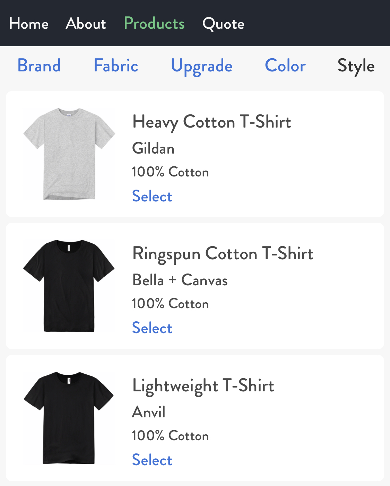
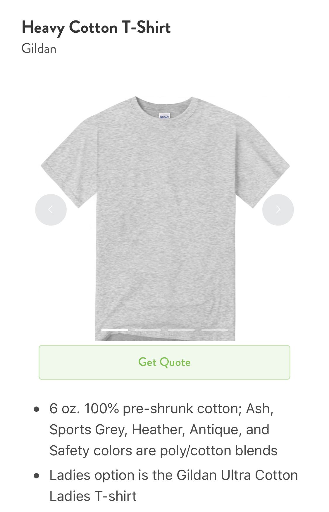
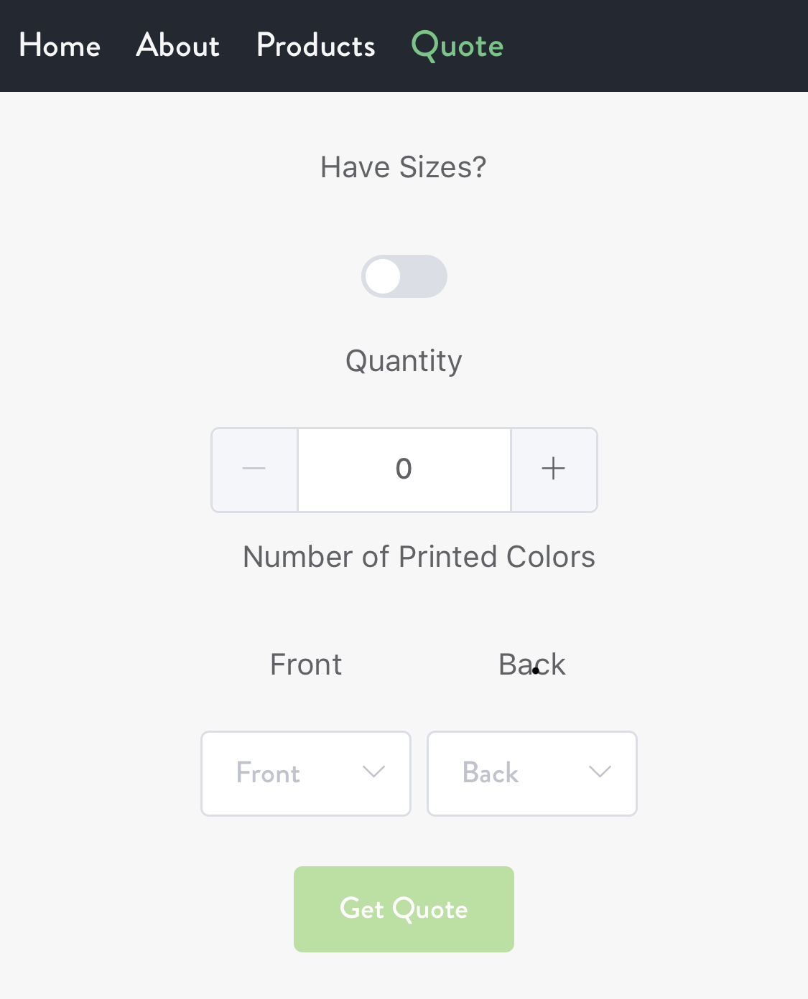

# playground

## This is an example project for a screenprinting company website

### You will be able to view products / get pricing for a print job










## Project setup

```
npm install
```

### Compiles and hot-reloads for development

```
npm run serve
```

### Compiles and minifies for production

```
npm run build
```
